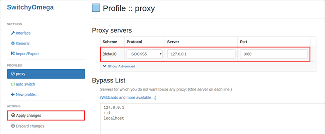
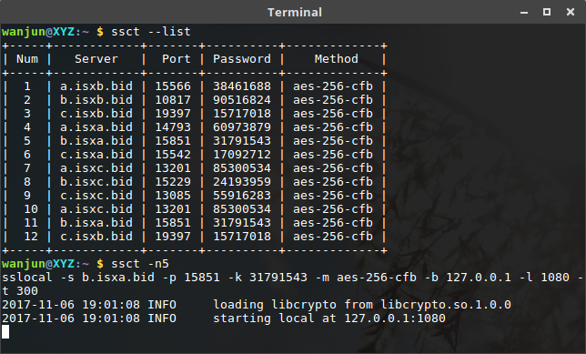
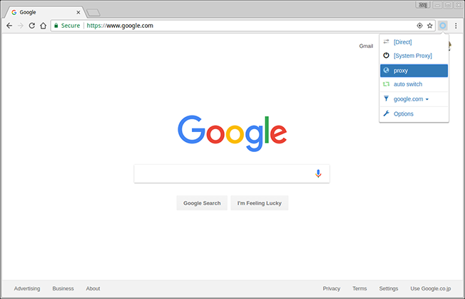

# ShadowSocks ConnecTion

[](ssct)
[](README_zh.md)

A wrapper tool for [shadowsocks](https://github.com/shadowsocks/shadowsocks) to consistently bypass firewalls.

## Quick start
### Automatically connect
The easiest way to run this tool is just type `ssct` in terminal, and ssct will acquire available shadowsocks servers from [ishadowsocks](https://global.ishadowx.net) and connect to it automatically.

### Connect to a specific server

First, show all ss servers by `--list` option.

```
ssct --list
```

Then, connect to a specific server by `-n` option.

```
ssct -n 5
```

Alternatively, you can connect a custom server.

```
ssct -s <server_addr> -p <server_port> -l <local_port> -k <password> -m <method>
```

## Usage

### Requirements

1 Install shadowsocks and requests (Required)

```
pip3 install shadowsocks
pip3 install requests
```

2 Install prettytable (Optional)

```
pip3 install prettytable
```

**Note:** The module `prettytable` is optional, but would be better if installed.

### Configuration for chrome and firefox

1. Install extension Proxy SwitchyOmega ([Chrome version](https://chrome.google.com/webstore/detail/proxy-switchyomega/padekgcemlokbadohgkifijomclgjgif), [Firefox version](https://addons.mozilla.org/en-US/firefox/addon/switchyomega/)).
2. Open the options of SwitchyOmega, and configure as below.  

3. List servers and select one to connect, or just type `ssct` to connect automatically.

4. Select proxy option in chrome or firefox and enjoy it.


## More options

```
optional arguments:
  -h, --help         show this help message and exit

ssct options:
  -n <num>           connect server number
  --list             list all ss servers
  --version          show program's version number and exit

shadowsocks options:
  -c <config>        path to config file
  -s <addr>          server address, auto crawl online
  -p <port>          server port, auto crawl online
  -b <addr>          local binding address [default: 127.0.0.1]
  -l <port>          local port [default: 1080]
  -k <password>      password, auto crawl online
  -m <method>        encryption method, auto crawl online
  -t <timeout>       timeout in seconds [default: 300]
  --fast-open        use TCP_FASTOPEN, requires Linux 3.7+
  -d <daemon>        daemon mode, one of start, stop and restart
  --pid-file <file>  pid file for daemon mode
  --log-file <file>  log file for daemon mode
  --user <user>      username to run as
  -v, -vv            verbose mode
  -q, -qq            quiet mode, only show warnings/errors
```

Connect to the available server automatically without any argument.

## LICENSE

Permission is hereby granted, free of charge, to any person, without any restriction.
